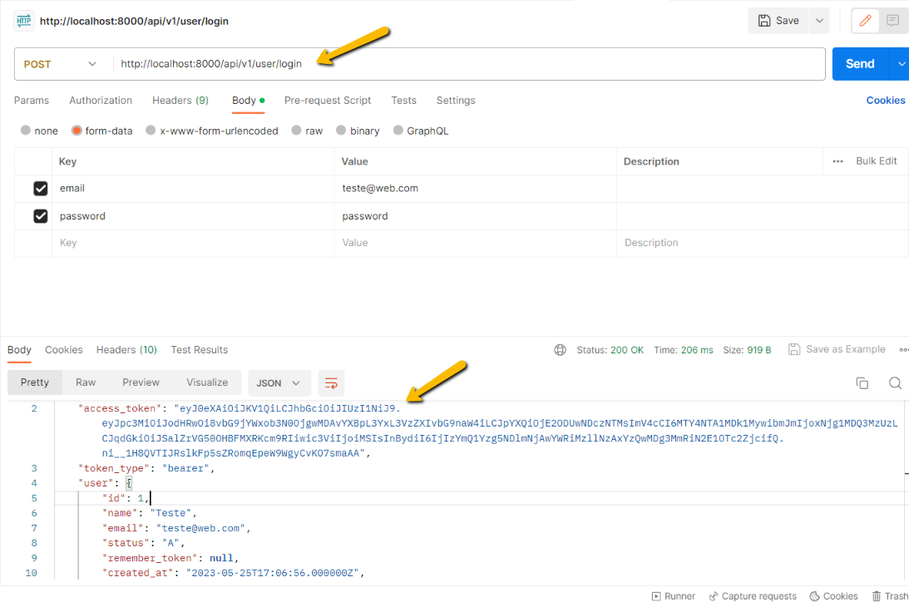
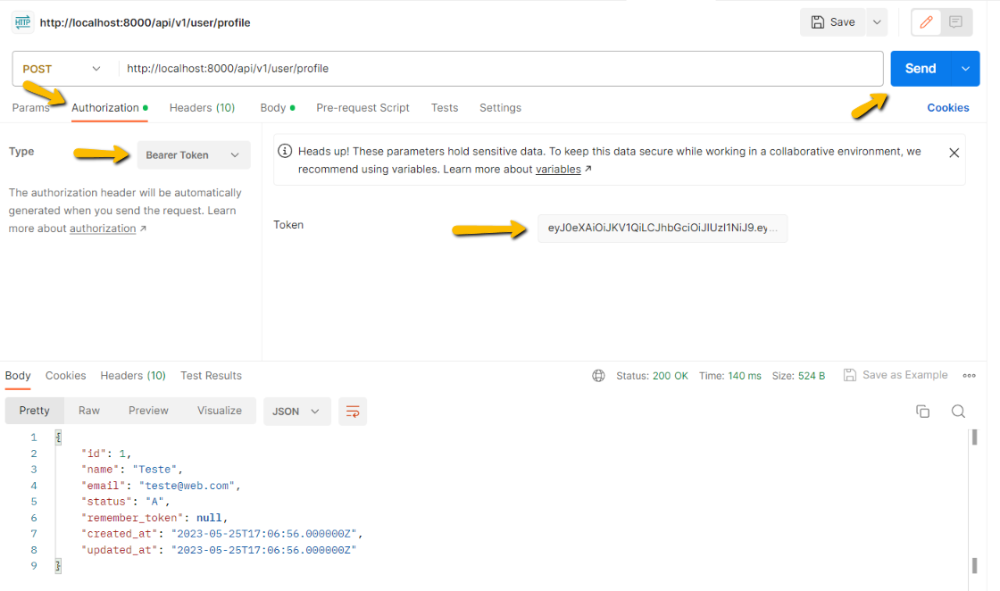
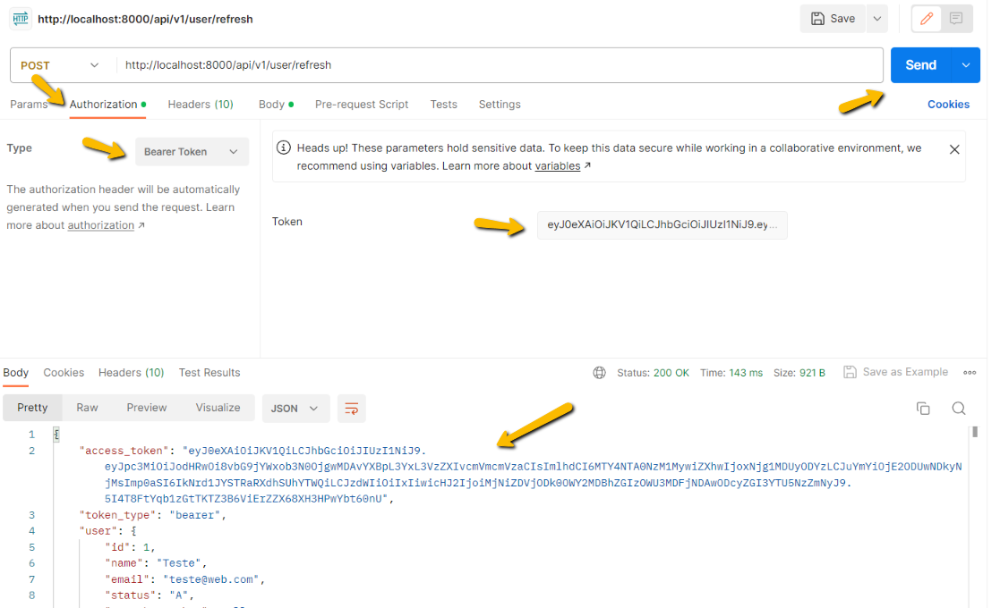
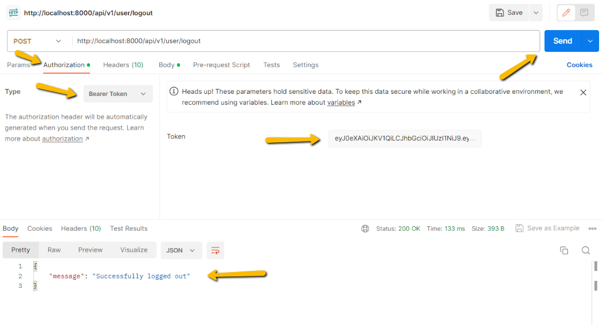


## Lumen 10 - Antenticação JWT

Passo a passo de autenticação JWT na API Lumen 10 para um único tipo de usuário.

Além da autenticação, será incluso verificação para que apenas usuários ativos consigam logar e configuração do CORS.

### Versões de softwares utilizados nesse tutorial

- Lumen 10.0.0

  https://lumen.laravel.com/docs/10.x

- tymon/jwt-auth 2.0.0

  https://github.com/tymondesigns/jwt-auth

### Siga as etapas

1 - Obtenha o micro-framework Lumen, via linha de comando execute.

````bash
# Baixa o micro-framework
composer create-project --prefer-dist laravel/lumen lumen_api "10.0.*"

# Entra na pasta
cd lumen_api
````

Os demais passos serão executados dentro pasta **lumen_api** que é a pasta raiz da nossa **API**.

2 - Crie o arquivo **config/auth.php** e adicione o conteúdo.

````php
<?php

return [
    'defaults' => [
        'guard' => 'api',
        'passwords' => 'users',
    ],

    'guards' => [
        'api' => [
            'driver' => 'jwt',
            'provider' => 'users',
        ],
    ],

    'providers' => [
        'users' => [
            'driver' => 'eloquent',
            'model' => \App\Models\User::class
        ]
    ]
];
````

3 - Para criar a autenticação será usado o pacote **tymon/jwt-auth**, execute o comando para instalar.

````bash
composer require tymon/jwt-auth:2.*
````

Copie o arquivo **vendor/tymon/jwt-auth/config/config.php** e cole na pasta **config**.

Depois na pasta **config**, renomeie o arquivo de **config.php** para **jwt.php**.

4 - No arquivo **bootstrap/app.php**, pesquise as instruções e execute os passos abaixo.

````php
# Descomente essa linha
$app->withFacades(); 

# Descomente essa linha
$app->withEloquent(); 

# Descomente esse bloco
$app->routeMiddleware([
    'auth' => App\Http\Middleware\Authenticate::class,
]);

# Descomente essa linha
$app->register(App\Providers\AuthServiceProvider::class);

# Adicione essa linha abaixo da anterior
$app->register(Tymon\JWTAuth\Providers\LumenServiceProvider::class);

# Adicione a linha abaixo de $app->configure('app');
$app->configure('jwt');
````

5 - Execute o comando para gerar a chave JWT.

````bash
php artisan jwt:secret
````

6 - Usaremos o banco de dados, no meu caso estou usando **MySql**, portanto configure seu **.env** e não esqueça de criar o banco de dados.

````bash
DB_CONNECTION=mysql
DB_HOST=127.0.0.1
DB_PORT=3306
DB_DATABASE=YOUR_DB_NAME
DB_USERNAME=YOUR_DB_USERNAME
DB_PASSWORD=YOUR_DB_PASSWORD
````

7 - Rode o **migrate**.

````bash
php artisan migrate
````

Isso já criará a tabela **migrations** que controla as migrações de banco.

8 - Crie a tabela de usuários

````bash
# O comando gera um arquivo em database/migrations
php artisan make:migration create_users_table
````

e adicione o seguinte conteúdo:

````php
<?php

use Illuminate\Database\Migrations\Migration;
use Illuminate\Database\Schema\Blueprint;
use Illuminate\Support\Facades\Schema;

return new class extends Migration
{
    /**
     * Run the migrations.
     */
    public function up(): void
    {
        Schema::create('users', function (Blueprint $table) {
            $table->id();
            $table->string('name');
            $table->string('email')->unique();
            $table->string('password');
            $table->enum('status', ['A', 'I'])->default('A');
            $table->rememberToken();
            $table->timestamps();
        });
    }

    /**
     * Reverse the migrations.
     */
    public function down(): void
    {
        Schema::dropIfExists('users');
    }
};
````

Salve o arquivo e rode o **migrate**.

````bash
php artisan migrate
````

9 - Vamos criar um **Seeder** para registrar um usuário para testes.

````bash
# O comando gera um arquivo em database/seeders
php artisan make:seeder UserSeeder
````

E adicione o seguinte conteúdo:

````php
<?php

namespace Database\Seeders;

use App\Models\User;
use Illuminate\Database\Seeder;
use Illuminate\Support\Facades\Hash;
use Illuminate\Database\Console\Seeds\WithoutModelEvents;

class UserSeeder extends Seeder
{
    /**
     * Run the database seeds.
     */
    public function run(): void
    {
        User::create([
            'name' => 'Teste', 
            'email' => 'teste@web.com',
            'password' => Hash::make('password')
        ]);
    }
}

````

10 - Adicione o seed criado na classe **DatabaseSeeder**.

````php
...
public function run()
{
  # Adicione essa linha
  $this->call(UserSeeder::class);
}

````

11 - Execute o comando para criar o usuário.

````bash
php artisan db:seed
````

12 - Crie as rotas, adicione as linhas abaixo no arquivo **routes/web.php**.

````php
$router->group(['prefix' => 'api/v1/user'], function () use ($router) {
    $router->post('login', 'AuthJWTController@login');
    $router->post('logout', 'AuthJWTController@logout');
    $router->post('refresh', 'AuthJWTController@refresh');
    $router->post('profile', 'AuthJWTController@profile');
});
````

13 - É opcional, mas para facilitar, vou adicionar o pacote **flipbox/lumen-generator** que permite rodar comandos para gerar recursos.

````bash
composer require flipbox/lumen-generator
````

No arquivo **bootstrap/app.php**, adicione a linha.

````bash
$app->register(Flipbox\LumenGenerator\LumenGeneratorServiceProvider::class);
````

14 - Gere o controller **AuthJWTController**.

````bash
php artisan make:controller AuthJWTController
````

E adiocione o seguinte conteúdo.

````php
<?php

namespace App\Http\Controllers;

use Illuminate\Http\Request;
use Illuminate\Support\Facades\Auth;

class AuthJWTController extends Controller
{
    public function __construct()
    {
        $this->middleware('auth:api', ['except' => ['login']]);
    }
    /**
     * Get a JWT via given credentials.
     *
     * @param  Request  $request
     * @return Response
     */
    public function login(Request $request)
    {
        $this->validate($request, [
            'email' => 'required|string',
            'password' => 'required|string',
        ]);

        $credentials = $request->only(['email', 'password']);
        $credentials['status'] = 'A'; # Autentica apenas usuário ativo

        if (! $token = Auth::attempt($credentials)) {
            return response()->json(['message' => 'Invalid credentials'], 401);
        }

        return $this->jsonResponse($token);
    }

     /**
     * Get the authenticated User.
     *
     * @return \Illuminate\Http\JsonResponse
     */
    public function profile()
    {
        return response()->json(auth()->user());
    }

    /**
     * Log the user out (Invalidate the token).
     *
     * @return \Illuminate\Http\JsonResponse
     */
    public function logout()
    {
        auth()->logout();

        return response()->json(['message' => 'Successfully logged out']);
    }

    /**
     * Refresh a token.
     *
     * @return \Illuminate\Http\JsonResponse
     */
    public function refresh()
    {
        return $this->jsonResponse(auth()->refresh());
    }

    /**
     * Get the token array structure.
     *
     * @param  string $token
     *
     * @return \Illuminate\Http\JsonResponse
     */
    protected function jsonResponse($token)
    {
        return response()->json([
            'access_token' => $token,
            'token_type'   => 'bearer',
            'user'         => auth()->user(),
            'expires_in'   => auth()->factory()->getTTL() * 60 * 24
        ]);
    }
}
````

15 - Atualize o model **User**, deixando a seguinte forma.

````php
<?php

namespace App\Models;

use Illuminate\Auth\Authenticatable;
use Illuminate\Contracts\Auth\Access\Authorizable as AuthorizableContract;
use Illuminate\Contracts\Auth\Authenticatable as AuthenticatableContract;
use Illuminate\Database\Eloquent\Factories\HasFactory;
use Illuminate\Database\Eloquent\Model;
use Laravel\Lumen\Auth\Authorizable;
use Tymon\JWTAuth\Contracts\JWTSubject; # Adicione essa linha

class User extends Model implements AuthenticatableContract, AuthorizableContract, JWTSubject /*Adicione a interface ao lado JWTSubject*/
{
    use Authenticatable, Authorizable, HasFactory;

    /**
     * The attributes that are mass assignable.
     *
     * @var string[]
     */
    protected $fillable = [
        'name', 'email', 'password'
    ];

    /**
     * The attributes excluded from the model's JSON form.
     *
     * @var string[]
     */
    protected $hidden = [
        'password',
    ];

    /**
     * Get the identifier that will be stored in the subject claim of the JWT.
     *
     * @return mixed
     */
    public function getJWTIdentifier()
    {
        return $this->getKey();
    }

    /**
     * Return a key value array, containing any custom claims to be added to the JWT.
     *
     * @return array
     */
    public function getJWTCustomClaims()
    {
        return [];
    }
}

````

16 - Vamos criar um middleware para verificar se usuário está ativo.

Na pasta **app/Http/Middleware**, crie o arquivo **IsActiveMiddleware.php** e adicione o conteúdo.

````php
<?php

namespace App\Http\Middleware;

use Closure;

/**
 * Inactive user is logged out
 */
class IsActiveMiddleware
{
    /**
     * Handle an incoming request.
     *
     * @param  \Illuminate\Http\Request  $request
     * @param  \Closure  $next
     * @return mixed
     */
    public function handle($request, Closure $next)
    {
        if(auth()->user() and auth()->user()->status == 'I'){
            auth()->logout();
            return response()->json(['message' => 'Not authorized'], 403);
        }
        return $next($request);
    }
}
````

Registre o middleware no arquivo **bootstrap/app.php**.

````php
# Descomente esse bloco
$app->middleware([
     App\Http\Middleware\IsActiveMiddleware::class # Adicione essa linha
]);
````

Esse middleware retorna **403** não autorizado, caso o usuário logado esteja com status de **Inativo**.

17 - Opcional, mas recomendado, configure o **CORS** para evitar problemas no consumo da **API**.

Na pasta **app/Http/Middleware**, crie o arquivo **CorsMiddleware.php** e adicione o conteúdo.

````php
<?php

namespace App\Http\Middleware;

class CorsMiddleware
{
    public function handle($request, \Closure $next)
    {
        if ($request->isMethod('OPTIONS')) {
            $response = response('', 200);
        } else {
            $response = $next($request);
        }
        $response->header('Access-Control-Allow-Methods', 'HEAD, GET, POST, PUT, PATCH, DELETE');
        $response->header('Access-Control-Allow-Headers', $request->header('Access-Control-Request-Headers'));
        $response->header('Access-Control-Allow-Origin', '*');
        return $response;
    }
}
````

Esse middleware retorna **200** caso o método requisitado seja **OPTIONS**.

Registre o middleware no arquivo **bootstrap/app.php**.

````php
# Descomente esse bloco
$app->middleware([
     App\Http\Middleware\CorsMiddleware::class # Adicione essa linha
]);
````

17 - Inicie o servidor para testar.

````bash
php artisan serve
````

### Consumindo a API

Para os exemplos de consumo abaixo usei software **Postman**.
Segue abaixo link para download.

https://www.postman.com/downloads/

#### Autenticando e obtendo token

Use o método **POST** e a seguinte **URL**.

http://localhost:8000/api/v1/user/login

Dados do usuário:

Email: teste@web.com

Senha: password



A partir de agora você usará esse token para consumir a **API**.

#### Obtendo dados do usuário logado

Use o método **POST** e a seguinte **URL**.

http://localhost:8000/api/v1/user/profile

Clique na aba **Authorization**, na combo **Type**, selecione **Bearer Token**.

No campo **Token**, informe o token recebido anteriormente e clique em **Send**.



#### Obtendo um novo token

Use o método **POST** e a seguinte **URL**.

http://localhost:8000/api/v1/user/refresh

Clique na aba **Authorization**, na combo **Type**, selecione **Bearer Token**.

No campo **Token**, informe o token recebido anteriormente e clique em **Send**.

Seu **token** anterior foi substituido por esse novo, portanto a partir de agora você de usar esse novo para consumir a **API**.



#### Deslogando da API

Use o método **POST** e a seguinte **URL**.

http://localhost:8000/api/v1/user/logout

Clique na aba **Authorization**, na combo **Type**, selecione **Bearer Token**.

No campo **Token**, informe o token recebido anteriormente e clique em **Send**.

Seu **token** anterior foi substituido por esse novo, portanto a partir de agora você de usar esse novo para consumir a **API**.



Todo o tutorial aplicado aqui, já se encontra pronto para uso nesse repositório.

Se você tiver em seu SO o **Docker** e **Docker Compose**, basta clonar e subir o ambiente com os seguintes comandos.

````bash
# Sobe os containers
docker compose up -d

# Entra no container da API
docker compose exec php-fpm bash

# Instala os pacotes necessários para o Lumen
composer install

# Cria as tabelas do banco
php artisan migrate

# Registra o usuário de teste
php artisan db:seed

# Dados do banco de dados
Usuário: lumen_api
Senha: lumen_api
Banco de dados: lumen_api
Porta: 3306

# Força a parada dos containers
docker compose kill

# Remove todos os containers (Cuidado só execute em ambiente de testes)
docker rm -f $(docker ps -a -q)
````

#### Documentação oficial do pacote JWT utilizado

https://jwt-auth.readthedocs.io/

#### Documentação oficial do Docker

https://docs.docker.com

## 🔗 Links
[](https://www.linkedin.com/in/tiago-s-costa)
